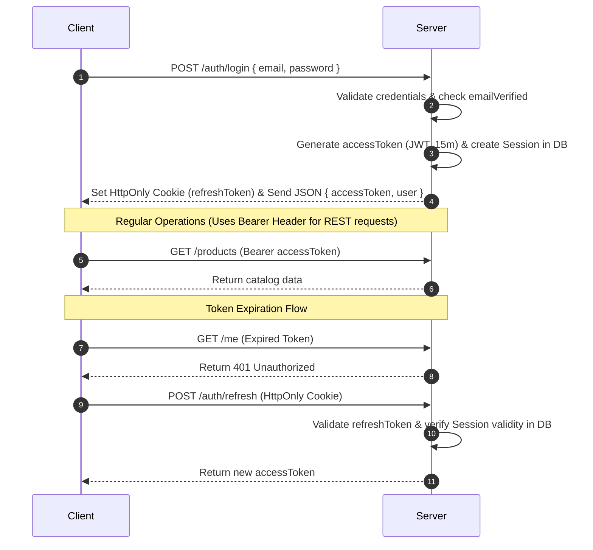
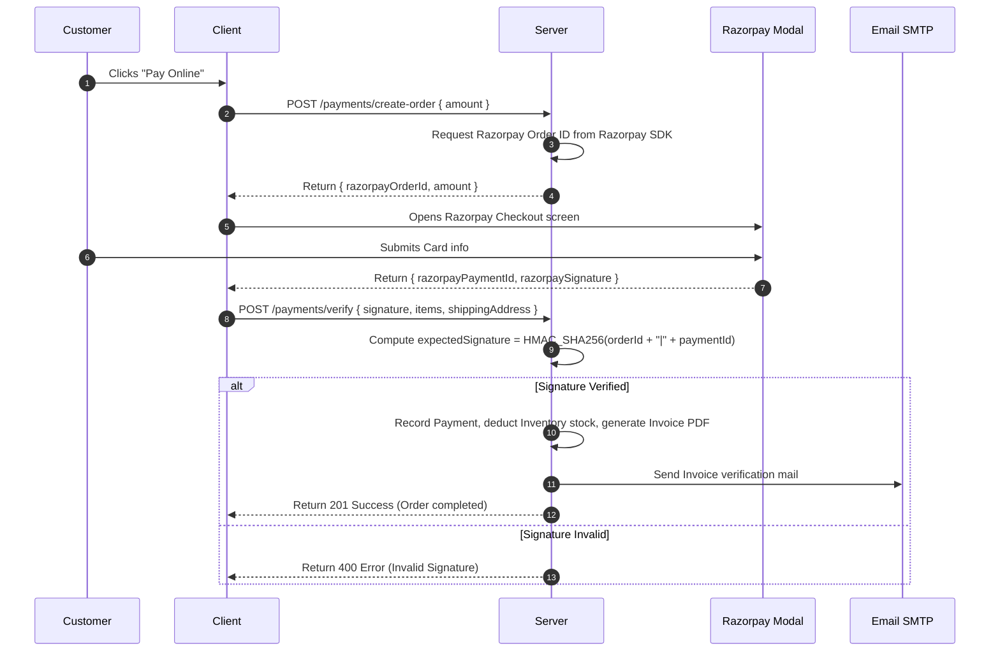
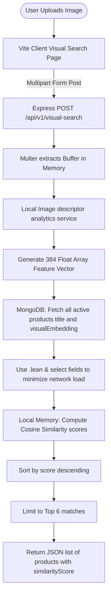
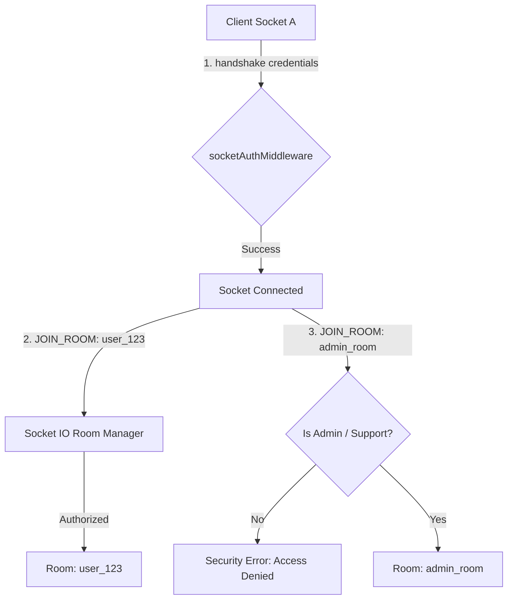

# ShopSphere System Architecture & Design Flows

This document details key operational designs, data flows, and websockets topologies.

---

## 🔑 Authentication Handshake Flow

---

## 💳 Checkout & Razorpay Payment Flow

---

## 🧠 AI Visual Similarity Search Flow

---

## 🔌 Socket.IO Communications Topologies

*   **Authentication**: Handshakes carry Bearer credentials inside connection variables, parsed by `socketAuthMiddleware`.
*   **Room Access Control Constraints**:
    *   **Customer Personal Room** (`user_userId`): Only accessible to the matching User ID or admin/support roles.
    *   **Admin Room** (`admin_room`): Only accessible to admin or support staff.
    *   **Product View Room** (`product_productId`): Publicly viewable; counts viewers.

